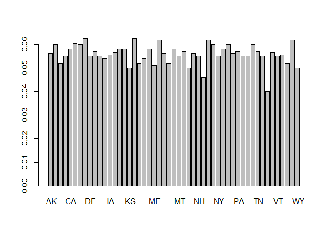

# Beer Breweries Data
Sanjee Yogeswaran  
June 26, 2017  

## Introduction

This is a case study on breweries and their ABV and IBU content.


```r
## Code to read in GDP and Education tables
beers <- read.csv("data/beers.csv", header=TRUE)
breweries <- read.csv("data/breweries.csv",header=TRUE)
## Question 1:
##Code to count number of breweries in each state
table(breweries$State)
```

```
## 
##  AK  AL  AR  AZ  CA  CO  CT  DC  DE  FL  GA  HI  IA  ID  IL  IN  KS  KY 
##   7   3   2  11  39  47   8   1   2  15   7   4   5   5  18  22   3   4 
##  LA  MA  MD  ME  MI  MN  MO  MS  MT  NC  ND  NE  NH  NJ  NM  NV  NY  OH 
##   5  23   7   9  32  12   9   2   9  19   1   5   3   3   4   2  16  15 
##  OK  OR  PA  RI  SC  SD  TN  TX  UT  VA  VT  WA  WI  WV  WY 
##   6  29  25   5   4   1   3  28   4  16  10  23  20   1   4
```

```r
## Question 2:
## Code to merge the two tables together
## Display first 6 rows and last 6 rows
mergedtables <- merge(beers,breweries, by.x=("Brewery_id"),by.y = ("Brew_ID"))
head(mergedtables,6)
```

```
##   Brewery_id        Name.x Beer_ID   ABV IBU
## 1          1  Get Together    2692 0.045  50
## 2          1 Maggie's Leap    2691 0.049  26
## 3          1    Wall's End    2690 0.048  19
## 4          1       Pumpion    2689 0.060  38
## 5          1    Stronghold    2688 0.060  25
## 6          1   Parapet ESB    2687 0.056  47
##                                 Style Ounces             Name.y
## 1                        American IPA     16 NorthGate Brewing 
## 2                  Milk / Sweet Stout     16 NorthGate Brewing 
## 3                   English Brown Ale     16 NorthGate Brewing 
## 4                         Pumpkin Ale     16 NorthGate Brewing 
## 5                     American Porter     16 NorthGate Brewing 
## 6 Extra Special / Strong Bitter (ESB)     16 NorthGate Brewing 
##          City State
## 1 Minneapolis    MN
## 2 Minneapolis    MN
## 3 Minneapolis    MN
## 4 Minneapolis    MN
## 5 Minneapolis    MN
## 6 Minneapolis    MN
```

```r
tail(mergedtables,6)
```

```
##      Brewery_id                    Name.x Beer_ID   ABV IBU
## 2405        556             Pilsner Ukiah      98 0.055  NA
## 2406        557  Heinnieweisse Weissebier      52 0.049  NA
## 2407        557           Snapperhead IPA      51 0.068  NA
## 2408        557         Moo Thunder Stout      50 0.049  NA
## 2409        557         Porkslap Pale Ale      49 0.043  NA
## 2410        558 Urban Wilderness Pale Ale      30 0.049  NA
##                        Style Ounces                        Name.y
## 2405         German Pilsener     12         Ukiah Brewing Company
## 2406              Hefeweizen     12       Butternuts Beer and Ale
## 2407            American IPA     12       Butternuts Beer and Ale
## 2408      Milk / Sweet Stout     12       Butternuts Beer and Ale
## 2409 American Pale Ale (APA)     12       Butternuts Beer and Ale
## 2410        English Pale Ale     12 Sleeping Lady Brewing Company
##               City State
## 2405         Ukiah    CA
## 2406 Garrattsville    NY
## 2407 Garrattsville    NY
## 2408 Garrattsville    NY
## 2409 Garrattsville    NY
## 2410     Anchorage    AK
```

```r
## Question 3:
##Count number of NAs in each column
colSums(is.na(mergedtables))
```

```
## Brewery_id     Name.x    Beer_ID        ABV        IBU      Style 
##          0          0          0         62       1005          0 
##     Ounces     Name.y       City      State 
##          0          0          0          0
```

```r
## Question 4:
##Compute median alcohol content
abv <- tapply(mergedtables$ABV,mergedtables$State,median,na.rm=T)
abv
```

```
##     AK     AL     AR     AZ     CA     CO     CT     DC     DE     FL 
## 0.0560 0.0600 0.0520 0.0550 0.0580 0.0605 0.0600 0.0625 0.0550 0.0570 
##     GA     HI     IA     ID     IL     IN     KS     KY     LA     MA 
## 0.0550 0.0540 0.0555 0.0565 0.0580 0.0580 0.0500 0.0625 0.0520 0.0540 
##     MD     ME     MI     MN     MO     MS     MT     NC     ND     NE 
## 0.0580 0.0510 0.0620 0.0560 0.0520 0.0580 0.0550 0.0570 0.0500 0.0560 
##     NH     NJ     NM     NV     NY     OH     OK     OR     PA     RI 
## 0.0550 0.0460 0.0620 0.0600 0.0550 0.0580 0.0600 0.0560 0.0570 0.0550 
##     SC     SD     TN     TX     UT     VA     VT     WA     WI     WV 
## 0.0550 0.0600 0.0570 0.0550 0.0400 0.0565 0.0550 0.0555 0.0520 0.0620 
##     WY 
## 0.0500
```

```r
##Compute median IBU
ibu <- tapply(mergedtables$IBU,mergedtables$State,median,na.rm=T)
ibu
```

```
##   AK   AL   AR   AZ   CA   CO   CT   DC   DE   FL   GA   HI   IA   ID   IL 
## 46.0 43.0 39.0 20.5 42.0 40.0 29.0 47.5 52.0 55.0 55.0 22.5 26.0 39.0 30.0 
##   IN   KS   KY   LA   MA   MD   ME   MI   MN   MO   MS   MT   NC   ND   NE 
## 33.0 20.0 31.5 31.5 35.0 29.0 61.0 35.0 44.5 24.0 45.0 40.0 33.5 32.0 35.0 
##   NH   NJ   NM   NV   NY   OH   OK   OR   PA   RI   SC   SD   TN   TX   UT 
## 48.5 34.5 51.0 41.0 47.0 40.0 35.0 40.0 30.0 24.0 30.0   NA 37.0 33.0 34.0 
##   VA   VT   WA   WI   WV   WY 
## 42.0 30.0 38.0 19.0 57.5 21.0
```

```r
##Plot bar graphs for ABV and IBU
library(ggplot2)
barplot(abv)
```

<!-- -->

```r
barplot(ibu)
```

<!-- -->

```r
## Question 5:
##Max values for ABV and IBU
which.max(abv)
```

```
##  DC 
##   8
```

```r
max(abv)
```

```
## [1] 0.0625
```

```r
which.max(ibu)
```

```
##  ME 
##  22
```

```r
max(ibu,na.rm=T)
```

```
## [1] 61
```

```r
## Question 6:
##Summary statistics for ABV
summary(abv)
```

```
##    Min. 1st Qu.  Median    Mean 3rd Qu.    Max. 
## 0.04000 0.05500 0.05600 0.05585 0.05800 0.06250
```

```r
##  Question 7:
##Plot abv vs ibu
qplot(abv,ibu)
```

```
## Warning: Removed 1 rows containing missing values (geom_point).
```

<!-- -->

```r
##Regression model
summary(lm(ibu ~ abv, data=mergedtables))
```

```
## 
## Call:
## lm(formula = ibu ~ abv, data = mergedtables)
## 
## Residuals:
##      Min       1Q   Median       3Q      Max 
## -15.9578  -7.4750  -0.4837   5.6112  27.2548 
## 
## Coefficients:
##             Estimate Std. Error t value Pr(>|t|)  
## (Intercept)  -0.8402    18.6174  -0.045   0.9642  
## abv         678.1451   332.8898   2.037   0.0472 *
## ---
## Signif. codes:  0 '***' 0.001 '**' 0.01 '*' 0.05 '.' 0.1 ' ' 1
## 
## Residual standard error: 9.842 on 48 degrees of freedom
##   (1 observation deleted due to missingness)
## Multiple R-squared:  0.07958,	Adjusted R-squared:  0.0604 
## F-statistic:  4.15 on 1 and 48 DF,  p-value: 0.04717
```

